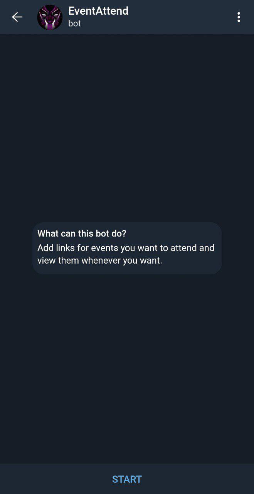
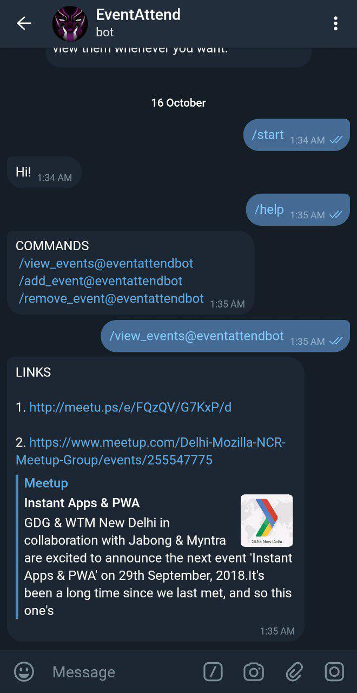

## **Telegram Links Bot** 
###[TRY IT](http://t.me/eventattendbot)

#### Adding, Removing and Storing Important links into a SQL database to be retrieved whenever needed.

The bot has the following commands (along with `/start`):
1. **add_event** Used to add links to the database. `/add_event <LINK>`
2. **remove_event** Used to remove link from the database. `/remove_event <LINK>`
3. **view_events** Used to view all the links in the database. `/view_events`
4. **help** Used to display all commands referencing th ebot for groups. `/help`

